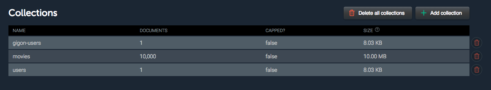

# tweb_te2_backend

# step 1

done 

  

# step 2
should be ok but i can't make it work

# step 3
okay, except that body always contain undefined fields (username, password) so I can't test it

# step 4
okay (almost I think), endpoint should also be secured

# deployement

heroku : 

	https://tweb-te2-gigon-backend.herokuapp.com/ 
	
not working in deployement server but working in local
	

